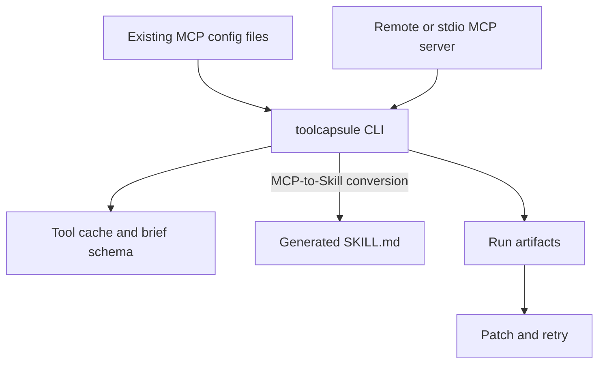

# Architecture



## Components

- `McpClient`: speaks JSON-RPC over stdio, using `mcp-remote` for remote endpoints.
- `Profile`: stores transport and shortcut configuration.
- `MCP importer`: reads existing MCP registrations from common agent config files and converts them into ToolCapsule profiles.
- `Skill generator`: performs the MCP-to-Skill step by writing `SKILL.md` and profile config.
- `Run recorder`: stores request, response, command, and error files.
- `Schema helpers`: produce compact tool summaries.

## MCP-to-Skill transformation flow

ToolCapsule keeps MCP as the capability layer and generates Agent Skills as the agent-facing workflow layer:

```text
Existing MCP registration
→ ToolCapsule profile
→ lazy-loaded Agent Skill
→ local args/content files
→ saved run artifacts
→ patch-and-retry recovery
```

This is a lazy MCP workflow: agents discover compact summaries first and load full MCP schemas only when the task requires them.

## Import path

```text
.mcp.json / .vscode/mcp.json / opencode.json / .gemini/settings.json / .cursor/mcp.json
→ .toolcapsule/profiles/<server>.json
→ .claude/skills/<server>-mcp/SKILL.md by default
```

The importer preserves string-valued `headers`, `env` / `environment`, and `cwd` fields where possible. User-level config is intentionally opt-in through `--include-user` because it can contain private endpoints or credential references.
