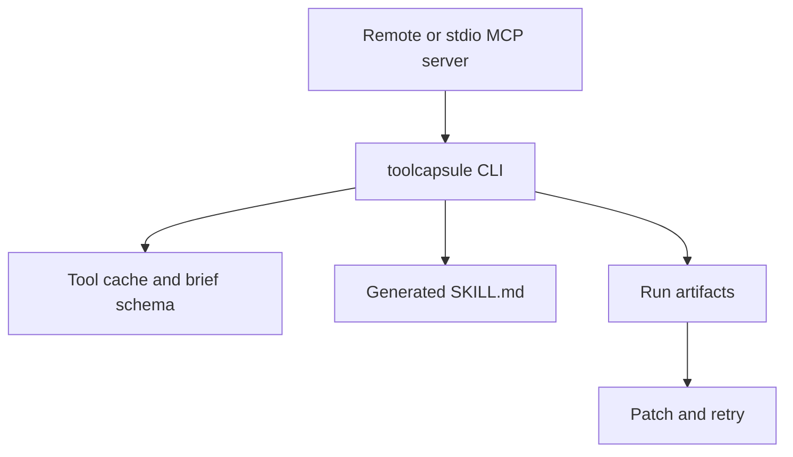

# Architecture

## Components

- `McpClient`: speaks JSON-RPC over stdio, using `mcp-remote` for remote endpoints.
- `Profile`: stores transport and shortcut configuration.
- `Skill generator`: writes `SKILL.md` and profile config.
- `Run recorder`: stores request, response, command, and error files.
- `Schema helpers`: produce compact tool summaries.
